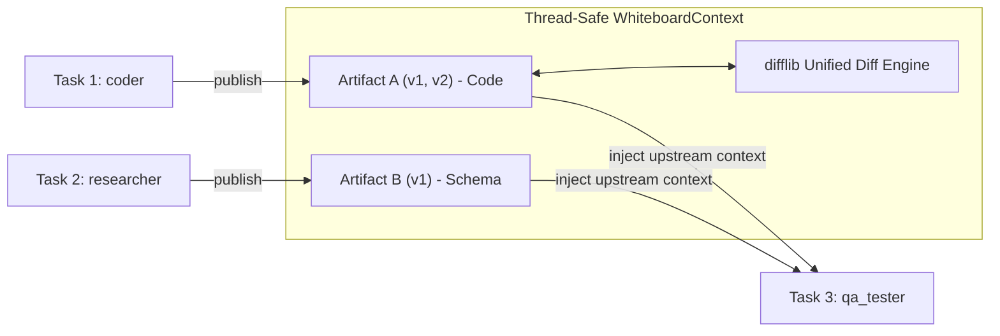

# Riva-AGI — System Architecture & Design Patterns (`architecture.md`)

## 1. Dual-Graph Architectural Pattern
The orchestration core leverages a dual-graph separation of concerns:

```mermaid
graph TD
    subgraph MacroLevel ["Macro-Level: LangGraph StateGraph (Pipeline Lifecycle Machine)"]
        START([START]) --> IntentNode["intent_node (Laya Engine ~33ms)"]
        IntentNode -->|Complex Goal| PlannerNode["planner_node (Hierarchical WBS)"]
        IntentNode -->|Simple Goal| SingleAgentNode["Direct Worker Execution"]
        
        PlannerNode --> ExecNode["executor_node"]
        
        subgraph MicroLevel ["Micro-Level: DAG Wave Scheduler & AsyncWorkerPool"]
            Wave0["Wave 0 (Parallel Concurrent): Task A + Task B"]
            Wave1["Wave 1: Task C (depends on Wave 0)"]
            Wave2["Wave 2 (Parallel Concurrent): Task D + Task E"]
            Wave0 --> Wave1 --> Wave2
        end
        ExecNode -.-> MicroLevel
        
        ExecNode --> ReviewerNode["reviewer_node (Quality Gate)"]
        ReviewerNode -->|Rejected (Retry <= 3)| ExecNode
        ReviewerNode -->|Approved| AggregatorNode["aggregator_node (Executive Synthesis)"]
        AggregatorNode --> ENDNode([END])
    end
```

---

## 2. In-Memory Blackboard Architecture (Whiteboard Pattern)



- **Thread-Safety**: Uses standard `threading.Lock` across concurrent worker threads.
- **Dependency Propagation**: Downstream tasks declare `depends_on = ["t1", "t2"]`. The executor automatically retrieves all artifacts authored by `t1` and `t2` and prepends them under `[UPSTREAM ARTIFACTS FROM WHITEBOARD]`.
- **Revision History**: If a subtask retries, new revisions append to `ArtifactHistory`. Diffs are calculated using `difflib.unified_diff`.

---

## 3. Execution Safety & Auto-Rollback Architecture

- **`WorkspaceTransactionManager`**:
  - Before a tool executes a write/edit operation on disk, the pre-state of the file is recorded in memory.
  - If the subtask fails, syntax check fails, or Reviewer exhausts `max_retries = 3`, `rollback()` deletes newly created files and restores original file contents.
  - Leaves the developer's workspace completely clean upon failure.

---

## 4. Latency Budget & Non-Autoregressive Optimization
- **Routing Decision**: 1–35ms (Laya decision engine, 0 tokens).
- **DAG Generation & Cycle Check**: <1ms (Kahn topological sort).
- **Subtask Review Verification**: <35ms (Laya Noul AST and syntax checks; LLM is only called if rejected and detailed critique is necessary).
